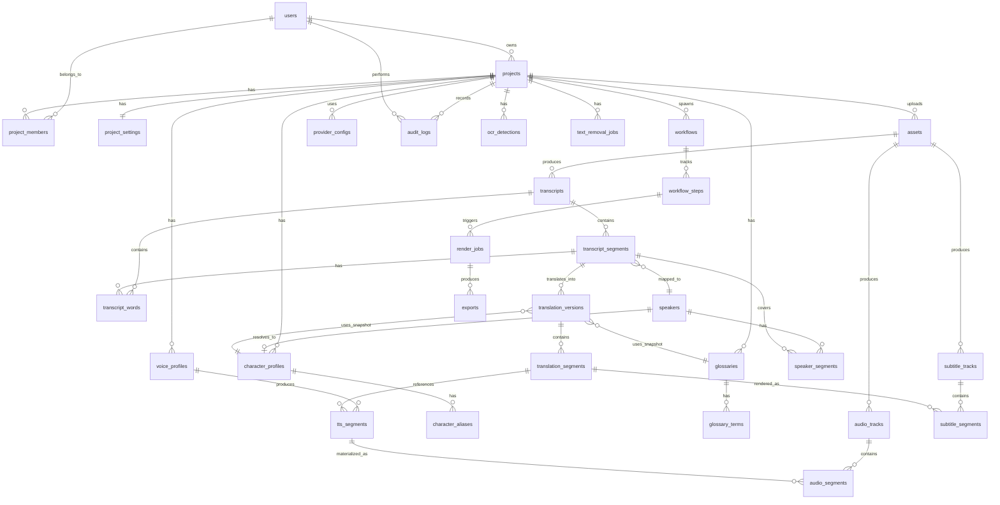

# ERD — Chinese → Vietnamese Video Localization (Phase 0)

ERD này mô tả các bảng chính cho PostgreSQL business DB. Binary video/audio/subtitle/object không nằm trong DB; chỉ lưu metadata và signature. Mọi version là append-only trong phase này; rollback bằng cách trỏ active pointer sang version mới.

Mermaid dưới đây là định nghĩa quan hệ ở mức logic, dùng để tạo schema migrations trong Phase 1.

## 1. Chi tiết thực thể chính

### users
- `id (uuid pk)`, `email (unique)`, `display_name`, `created_at`, `last_login_at`.
- Lưu role toàn cục (admin/standard).

### projects
- `id (uuid pk)`, `owner_id (fk users.id)`, `title`, `source_language`, `target_language`, `quality_mode`, `status`, `created_at`, `updated_at`, `language_profile (default 'zh-vi')`.
- `quality_mode ∈ {ONLY_SUBTITLE, STANDARD_DUBBING, QUALITY_DUBBING}`.
- `status ∈ {draft, processing, awaiting_review, ready, archived, failed}`.

### project_members
- `project_id`, `user_id`, `role (owner/editor/viewer)`, `added_at`. Unique `(project_id, user_id)`.

### project_settings
- `project_id (pk/fk)`, `genre`, `style_preset`, `subtitle_mode`, `accent_preference`, `audio_mode`, `music_level`, `dubbing_overrides jsonb`.

### assets
- `id (uuid pk)`, `project_id`, `kind (video, audio, subtitle_text)`, `storage_key`, `mime`, `size`, `duration_ms`, `probe jsonb`, `checksum_sha256`, `uploaded_at`, `uploaded_by`.

### transcripts
- `id (uuid pk)`, `asset_id (fk)`, `language_detected`, `language_profile`, `model_id`, `signature`, `created_at`.

### transcript_segments
- `id (uuid pk)`, `transcript_id (fk)`, `idx`, `start_ms`, `end_ms`, `raw_text`, `normalized_text`, `quality_flags jsonb`, `speaker_label` (raw label).

### transcript_words
- `id (uuid pk)`, `segment_id (fk)`, `idx`, `text`, `start_ms`, `end_ms`, `confidence`.

### speakers
- `id (uuid pk)`, `project_id`, `raw_label`, `character_profile_id (nullable fk)`, `display_name`, `gender`, `age_group`.

### speaker_segments
- `id (uuid pk)`, `speaker_id (fk)`, `start_ms`, `end_ms`, `segment_id (nullable fk)`, `confidence`.

### character_profiles
- `id (uuid pk)`, `project_id`, `name`, `gender`, `age_group`, `role`, `preferred_pronouns jsonb`, `preferred_honorifics jsonb`, `default_voice_profile_id (nullable)`.

### character_aliases
- `id (uuid pk)`, `character_profile_id (fk)`, `alias`, `locale`, `source_pattern`.

### glossaries
- `id (uuid pk)`, `project_id`, `name`, `version`, `created_at`, `is_active`.

### glossary_terms
- `id (uuid pk)`, `glossary_id (fk)`, `chinese`, `vietnamese`, `category`, `rule`, `priority`, `is_active`.

### translation_versions
- `id (uuid pk)`, `project_id`, `transcript_id (fk)`, `version`, `provider_id`, `model_id`, `prompt_version`, `glossary_snapshot_id (nullable fk)`, `character_bible_snapshot jsonb`, `style_preset`, `signature`, `created_at`, `is_active`.

### translation_segments
- `id (uuid pk)`, `translation_version_id (fk)`, `transcript_segment_id (fk)`, `display_text`, `tts_text`, `applied_glossary_terms jsonb`, `applied_aliases jsonb`, `qa_status`, `qa_issues jsonb`, `confidence`.

### voice_profiles
- `id (uuid pk)`, `project_id`, `name`, `provider_id`, `model_id`, `voice_id`, `default_accent`, `reference_audio_key (nullable)`, `reference_audio_hash`, `consent_status`, `consent_evidence_key`, `created_at`.

### tts_segments
- `id (uuid pk)`, `voice_profile_id (fk)`, `translation_segment_id (fk)`, `audio_segment_id (nullable fk)`, `signature`, `duration_ms`, `sample_rate`, `created_at`.

### audio_tracks
- `id (uuid pk)`, `asset_id (fk)`, `kind (original, vocals, accompaniment, music, sfx, dub, mix)`, `storage_key`, `duration_ms`, `sample_rate`, `channels`.

### audio_segments
- `id (uuid pk)`, `audio_track_id (fk)`, `start_ms`, `end_ms`, `storage_key`, `source (tts | separated | original)`, `signature`.

### subtitle_tracks
- `id (uuid pk)`, `asset_id (fk)`, `kind (source_zh, target_vi, bilingual)`, `language_code`, `format (srt, vtt, ass)`.

### subtitle_segments
- `id (uuid pk)`, `subtitle_track_id (fk)`, `idx`, `start_ms`, `end_ms`, `display_text`, `translation_segment_id (nullable fk)`, `signature`.

### workflows
- `id (uuid pk)`, `project_id (fk)`, `temporal_workflow_id`, `temporal_run_id`, `quality_mode`, `status`, `started_at`, `ended_at`, `last_error jsonb`.

### workflow_steps
- `id (uuid pk)`, `workflow_id (fk)`, `name`, `status`, `attempt`, `progress_pct`, `progress_message`, `artifact_signature`, `started_at`, `ended_at`.

### render_jobs
- `id (uuid pk)`, `workflow_id (fk)`, `kind (preview, final)`, `status`, `output_storage_key`, `progress_pct`, `validation jsonb`, `created_at`.

### exports
- `id (uuid pk)`, `render_job_id (fk)`, `format`, `storage_key`, `size`, `checksum_sha256`, `expires_at`, `signed_url_expires_at`.

### ocr_detections
- `id (uuid pk)`, `asset_id (fk)`, `text`, `bbox jsonb`, `frame_ts_ms`, `confidence`, `model_id`, `language`.

### text_removal_jobs
- `id (uuid pk)`, `asset_id (fk)`, `strategy (inpaint, cover, blur)`, `status`, `output_storage_key`, `bbox_payload jsonb`.

### provider_configs
- `id (uuid pk)`, `project_id (nullable)`, `provider_kind (asr, align, diarize, translate, tts, separate, ocr, removal, storage)`, `provider_id`, `config jsonb`, `is_active`.

### audit_logs
- `id (uuid pk)`, `project_id (nullable)`, `user_id (nullable)`, `entity_type`, `entity_id`, `action`, `payload jsonb`, `created_at`.

## 2. Quan hệ phụ trợ

- `translation_versions.glossary_snapshot_id` FK `glossaries(id)` cho phép giữ nhiều phiên bản glossary; provider nhận snapshot để reproducibility.
- `voice_profiles.reference_audio_hash` FK logic đến `assets(id)` loại audio.
- `render_jobs.validation` lưu kết quả kiểm tra từ `validation.second_pass_asr` và FFprobe checks.

## 3. Unique constraints tiêu biểu

- `transcripts (asset_id, signature)` unique.
- `translation_versions (project_id, transcript_id, version)` unique.
- `translation_versions (transcript_id, signature)` unique để tránh duplicate cache.
- `glossary_terms (glossary_id, chinese)` unique.
- `workflows (temporal_workflow_id, temporal_run_id)` unique.
- `assets (storage_key)` unique.
- `exports (render_job_id, format)` unique.

## 4. Append-only & versioning

- `transcripts`, `translation_versions`, `tts_segments`, `audio_segments`, `subtitle_segments`, `render_jobs`, `exports`, `audit_logs` đều append-only. Update chỉ đổi `is_active` hoặc thêm version mới.
- Domain chỉ truy vấn version mới nhất hoặc version được trỏ tới; cũ vẫn còn cho rollback và audit.

## 5. Storage key convention

- Object key: `projects/{project_id}/assets/{asset_id}/{artifact_kind}/{version}/{filename}`.
- Artifact kinds: `raw`, `audio_extracted`, `asr`, `alignment`, `diarization`, `translation`, `subtitle`, `tts`, `audio_separated`, `audio_mix`, `render`, `export`.
- Object key do server sinh; user input không ảnh hưởng key để tránh path traversal.

## 6. Phase 1 sẽ dùng ERD này để

- Sinh Alembic migration đầu tiên.
- Xây SQLAlchemy ORM models tương ứng.
- Tạo repository layer cho từng aggregate (transcript, translation, voice, render).
- Tạo audit middleware tự động ghi `audit_logs` cho các thay đổi state.
