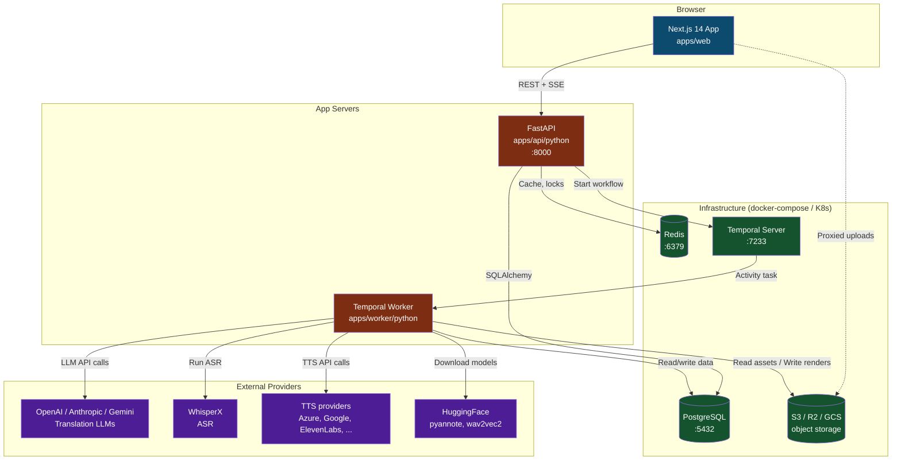
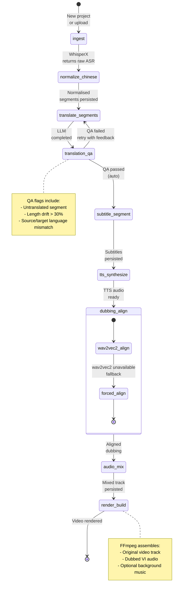
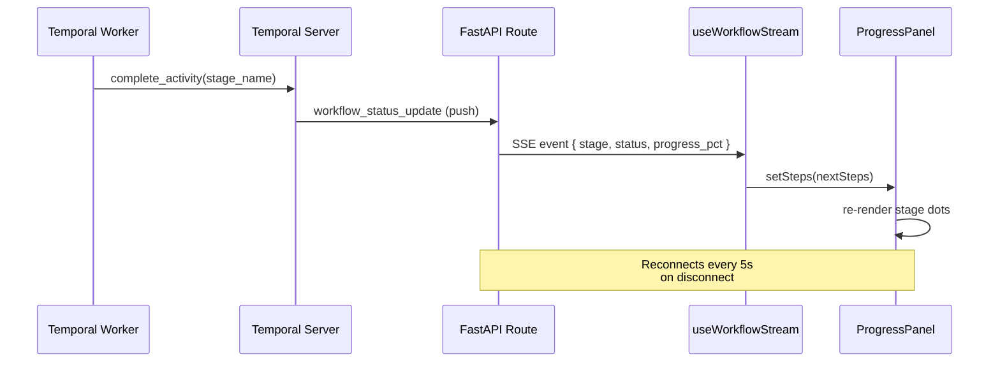
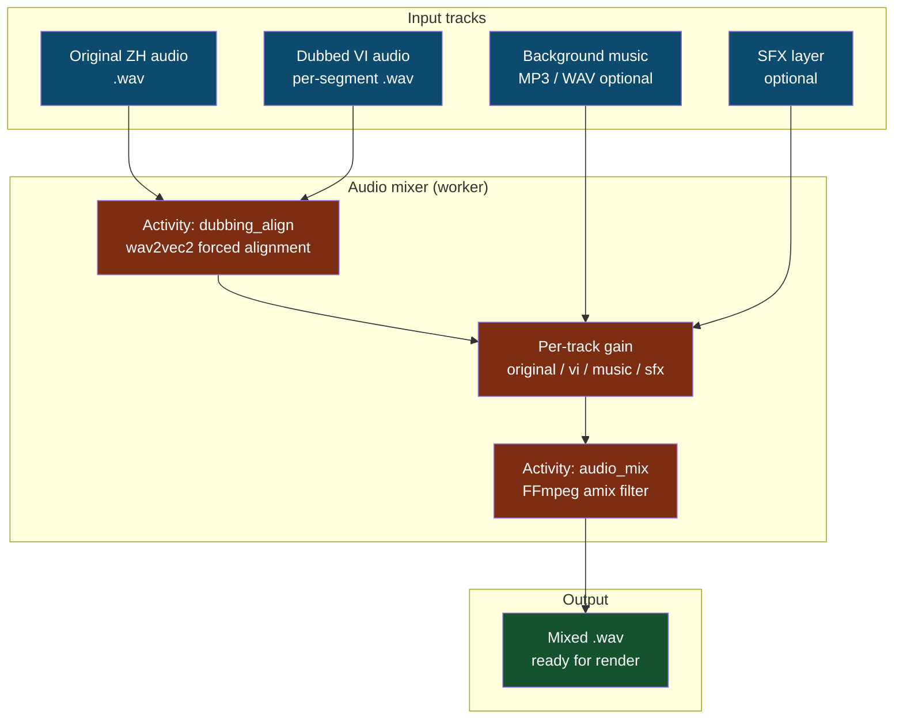

# 🏗️ Architecture Diagrams

**Last Updated:** 2026-09-04
**Audience:** Engineers onboarding to the PhimNgan repository app, technical writers, ops.

These Mermaid diagrams document the runtime topology of the platform. They are
rendered automatically by GitHub, GitLab, VS Code (with Mermaid extension), and
most modern Markdown viewers.

> **Tip:** Mermaid `flowchart` and `stateDiagram-v2` blocks render natively on
> GitHub. To preview locally, install the "Markdown Preview Mermaid Support"
> VS Code extension or paste into <https://mermaid.live>.

---

## 1. System Topology — services and their dependencies

High-level view: how the three apps (web, API, worker) connect to each other
and to external infrastructure.



---

## 2. Workflow State Machine — Temporal pipeline lifecycle

The full dubbing pipeline is one Temporal workflow with eight named activities.
Each activity maps to one user-visible stage in the workspace Progress panel.



---

## 3. Provider Registry — pluggable LLM / TTS / ASR

The provider registry pattern (`apps/api/python/translator_api/providers/`)
lets us add new translation or TTS backends without changing call sites.

```mermaid
flowchart LR
    subgraph Caller["Worker activities"]
        Activity[activities_providers.py<br/>activities_phase3.py]
    end

    subgraph Registry["Provider Registry<br/>(registry.py)"]
        Bootstrap[bootstrap&#40;&#41;<br/>loads defaults]
        Dict[(provider_id → instance)]
    end

    subgraph Trans["Translation providers"]
        OpenAI[OpenAITranslator]
        Anthropic[AnthropicTranslator]
        Gemini[GeminiTranslator]
        Local[LocalLLMTranslator]
        Passthrough[PassthroughTranslator]
    end

    subgraph TTS["TTS providers"]
        Azure[AzureTTS]
        Google[GoogleTTS]
        ElevenLabs[ElevenLabsTTS]
        Edge[EdgeTTS]
        Qwen3[Qwen3TTS]
    end

    subgraph OCR["OCR providers"]
        CRAFT[CRAFTOCR]
        Easy[EasyOCR]
        Paddle[PaddleOCR]
    end

    Activity -->|provider_id| Registry
    Bootstrap --> Dict
    Dict --> Trans
    Dict --> TTS
    Dict --> OCR

    classDef caller fill:#0c4a6e,color:#fff;
    classDef reg fill:#7c2d12,color:#fff;
    classDef prov fill:#14532d,color:#fff;
    class Activity caller;
    class Bootstrap,Dict reg;
    class OpenAI,Anthropic,Gemini,Local,Passthrough,Azure,Google,ElevenLabs,Edge,Qwen3,CRAFT,Easy,Paddle prov;
```



**Adding a new provider** — see [`provider-guide.md`](./provider-guide.md).

---

## 4. Editor Data Flow — from REST to Zustand to React

How a single API list call makes its way into a panel component.

```mermaid
flowchart LR
    subgraph API["FastAPI"]
        Router[routers_editor.py]
        Repo[EditorRepository]
        Model[(transcript_segments<br/>table)]
    end

    subgraph Web["Next.js app"]
        Client[lib/api.ts<br/>api.listTranscript&#40;&#41;]
        Store[lib/store.ts<br/>Zustand]
        Panel[TranscriptPanel.tsx]
    end

    Router -->|SQLAlchemy| Repo
    Repo -->|SELECT| Model
    Router -->|JSON {segments, total}| Client
    Client -->|loadTranscript&#40;rows&#41;| Store
    Store -->|useEditor selector| Panel
    Panel -->|Skeleton / List / Empty| UI[Rendered UI]

    classDef api fill:#7c2d12,color:#fff;
    classDef web fill:#0c4a6e,color:#fff;
    class Router,Repo,Model api;
    class Client,Store,Panel,UI web;
```

---

## 5. SSE Streaming — real-time progress

The `useWorkflowStream` hook opens an EventSource to `/api/workflows/:id/events`
and pushes workflow state updates to the UI without polling.



---

## 6. Audio Mixing Pipeline

`useAudioMixer` + `apps/api/python/translator_api/routers_editor.py` mix
original audio, dubbed VI voice, and optional background music.



---

## 📐 Rendering locally

```bash
# Option A — VS Code
code --install-extension bierner.markdown-mermaid

# Option B — mermaid-cli (PNG export)
npm install -g @mermaid-js/mermaid-cli
mmdc -i docs/architecture-diagrams.md -o out/architecture.png
```

---

## Related docs

- [`architecture.md`](./architecture.md) — narrative architecture description
- [`workflow.md`](./workflow.md) — pipeline details (non-visual)
- [`providers.md`](./providers.md) — provider registry details
- [`provider-guide.md`](./provider-guide.md) — how to add a new provider

---

**Maintained by:** AI Agent + Engineering
**Last reviewed:** 2026-09-04
