# Architecture — Chinese → Vietnamese Video Localization (Phase 0)

Tài liệu này định nghĩa kiến trúc tổng thể của hệ thống. Phase 0 chỉ tạo tài liệu; chưa cài dependency, chưa viết code Phase 1.

## 1. Mục tiêu kiến trúc

- **Provider-agnostic domain**: mọi provider (ASR, alignment, diarization, translation, TTS, audio separation, OCR, text removal, storage) chỉ được gọi qua contract đã chốt trong `provider-contracts.md`. Domain không phụ thuộc SDK hoặc model cụ thể.
- **Chinese → Vietnamese chuyên sâu**: domain chỉ xử lý cặp ngôn ngữ này; không mở rộng locale lúc đầu. Locale-specific logic nằm trong `language profiles`.
- **Local-first / hybrid**: ASR, alignment, diarization, audio separation, TTS có thể chạy local; translation ưu tiên remote HTTP provider; người dùng có thể chuyển provider ở từng giai đoạn.
- **Long-video aware**: không load toàn bộ video/audio vào RAM; xử lý theo chunk, lưu artifact tạm có retention.
- **Reproducibility**: mỗi artifact có signature (input hash + model/provider + config + prompt/glossary version). Đổi bất kỳ thành phần nào → signature đổi → cache invalid.
- **Reliability**: retry/resume/cancel/heartbeat/continue-as-new. Worker crash → replay từ activity gần nhất chưa complete.
- **Auditability**: append-only versioning cho transcript, translation, audio mix, render. Có thể rollback bằng cách trỏ active version.

## 2. Boundary chính

```mermaid
flowchart LR
    subgraph client[Client]
      web[Next.js Web]
      uploader[Resumable Uploader]
    end

    subgraph api[API Layer - FastAPI]
      rest[REST API]
      sse[SSE / WebSocket Gateway]
      auth[AuthN / AuthZ]
      uploadSvc[Upload Service]
      projectSvc[Project Service]
      editorSvc[Editor Service]
    end

    subgraph orchestrator[Orchestration - Temporal]
      projW[Project Workflow]
      subW[Subtitle Child Workflow]
      dubW[Dubbing Child Workflow]
      chkW[Chunk Child Workflow]
      retry[Retry Policies]
    end

    subgraph workers[Worker Runtimes]
      cpuWorker[CPU Worker - FFmpeg, OCR, mix]
      asrWorker[GPU Worker - ASR/Alignment/Diarization]
      sepWorker[GPU Worker - Audio Separation]
      ttsWorker[GPU Worker - TTS]
    end

    subgraph providers[Provider Adapters]
      asrP[WhisperX / faster-whisper]
      vadP[Silero / pyannote]
      alignP[WhisperX align / wav2vec2]
      diarP[pyannote]
      trP[OpenAI-compatible HTTP / local LLM]
      qaP[Translation QA adapter]
      sepP[UVR / Demucs / BS-Roformer]
      ttsP[VieNeu / CosyVoice / VietVoice / Cloud]
      ocrP[PaddleOCR]
      txtP[Text Removal]
      storP[S3 API - MinIO dev adapter / managed prod]
    end

    subgraph data[Data]
      pg[(PostgreSQL)]
      obj[(Object Storage S3)]
      temporal[(Temporal Persistence)]
    end

    client --> api
    api --> orchestrator
    orchestrator --> workers
    workers --> providers
    providers --> data
    api --> data
```

## 3. Component ownership

| Layer | Tech | Trách nhiệm | Không chịu trách nhiệm |
|---|---|---|---|
| Web | Next.js App Router (TS) | Upload UI, dashboard, editor, settings, progress streaming | Không gọi model; chỉ gọi API |
| API | FastAPI + Pydantic | Auth, validation, job enqueue, status query, SSE/Signals | Không chạy model; không gọi trực tiếp Temporal activities |
| Orchestrator | Temporal | DAG execution, retry, resume, cancel, child workflow, continue-as-new | Không giữ business state (đó là PostgreSQL) |
| Worker | Python 3.11/3.12 | Chạy activities, chuyển output cho provider | Không biết về UI hay PostgreSQL schema |
| Provider adapter | Python | Gọi SDK/HTTP, normalize sang provider contract | Không truy cập DB trực tiếp |
| Data | PostgreSQL + S3 | Metadata, audit, versioned content; binary trên object storage | Không chạy logic workflow |

## 4. Workflow engine

- Temporal self-hosted cho dev; production có thể chọn Temporal Cloud.
- Temporal persistence (namespace store) dùng PostgreSQL riêng (`temporal` schema), không lẫn với business DB.
- Business state (project, segments, translation version, render job) nằm trong PostgreSQL business DB, không phải Temporal history.

## 5. Failure recovery & long-running jobs

- Activity retry: exponential backoff, max attempts theo từng provider; non-retryable error (`Permanent`, `CapabilityUnsupported`, `ConsentMissing`) raise ngay.
- Worker heartbeat: TTS dài, separation dài phải heartbeat theo interval phù hợp (ví dụ 30s).
- Continue-as-new: workflow tổng hoặc child workflow có thể dùng continue-as-new cho video dài > 60 phút để tránh event history limit.
- Cancel: user cancel → workflow cancel tất cả child → activity nhận `CancelledError` ở checkpoint an toàn → partial artifact cleanup.
- Resume: cùng `project_id` + `run_id` mới → replay event history, skip activity đã complete (idempotency dựa vào artifact signature).

## 6. Storage & artifact lifecycle

- Object key convention: `projects/{project_id}/assets/{asset_id}/{artifact_kind}/{version}/{filename}`. Không cho phép user input ảnh hưởng key.
- Artifact signature = `sha256(input_hash | model_id | model_version | provider_build | config_hash | prompt_version | glossary_snapshot_id | character_bible_snapshot_id)`.
- Retention: artifact tạm (preview, mid-flight) có TTL cấu hình; artifact chính (raw, transcript, translation, render) lưu theo project lifetime.
- Cleanup: cron scan orphan artifact (không còn reference trong DB), xóa sau N ngày với audit log.

## 7. Realtime & progress

- API cung cấp SSE endpoint `/projects/{id}/events`.
- Worker ghi progress vào PostgreSQL (`workflow_steps.status`, `progress_pct`, `last_message`).
- API đọc progress từ DB + activity heartbeat, phát SSE.
- Không fake progress: nếu không có tín hiệu mới, gửi heartbeat rỗng thay vì phát phần trăm giả.

## 8. Security

- AuthN: OIDC/JWT; AuthZ: RBAC theo `project.member`.
- Upload: presigned URL; size limit, MIME validation, magic-byte validation; không cho upload từ URL ngoài.
- FFmpeg: allowlist filter arguments; chạy trong container giới hạn CPU/memory; input/output path allowlist.
- Secrets: lưu trong secret manager; không log secret; secret rotation định kỳ.
- Rate limit: theo user/project/IP.
- Audit log: mọi action thay đổi project, đổi glossary, đổi voice profile đều ghi `audit_logs`.

## 9. Privacy & deletion

- Delete project: xóa DB record + object theo convention key; xóa cả preview, export, transcript cache.
- Delete intermediate: chỉ xóa artifact tạm; giữ lại artifact chính cho rollback.
- Soft delete trước, hard delete sau N ngày (audit trace trong thời gian đó).

## 10. Observability (placeholder cho Phase 12)

- Logging: structured JSON, có `trace_id`, `project_id`, `step_id`.
- Metrics: counters cho provider call, duration, error rate; histogram cho TTS/ASR per-segment.
- Tracing: OpenTelemetry-compatible, propagator giữa API → worker.

## 11. Deployment topology (placeholder)

- Tier 1 (dev/local): single node, docker-compose với API, worker, Temporalite, Postgres, MinIO local.
- Tier 2 (production): API/worker tách container; Temporal self-host hoặc Cloud; Postgres managed; S3 managed.
- Tier 3 (scale): GPU pool riêng cho ASR/TTS; CPU pool cho FFmpeg/OCR; queue per task-type.

## 12. Ranh giới Phase 0

- Phase 0 chưa tạo dependency manifests, Dockerfiles, schema migrations, code, model weights hay UI implementation.
- Tài liệu này định hướng Phase 1: chỉ bắt đầu Phase 1 sau khi kế hoạch được người dùng xác nhận.
