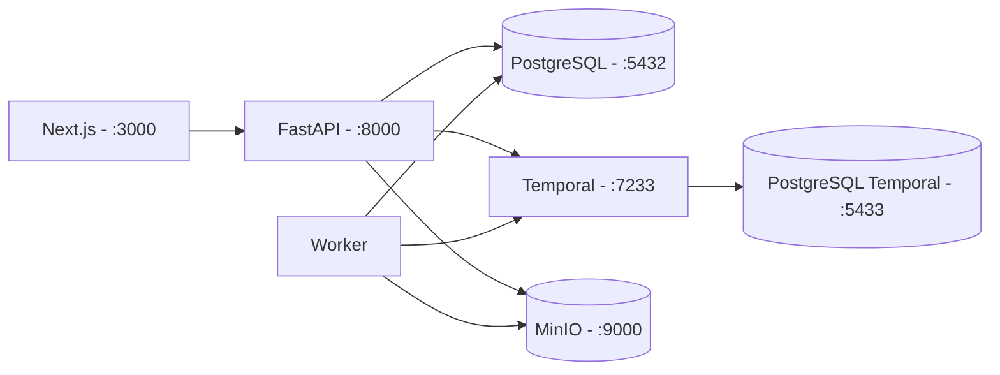
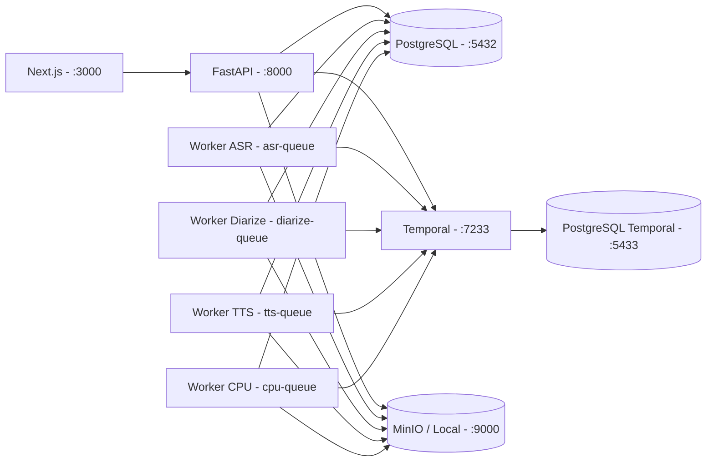

# Runtime Topology — Phase 1

## Tier 0 (Phase 1 dev)

- Một worker đăng ký toàn bộ activity stub. Task queue hiện dùng `project-queue`; Phase 2 sẽ tách `asr-queue`, `tts-queue`, `cpu-queue`, `gpu-queue`.
- MinIO được khởi tạo bucket `translator` bởi `minio-init`.
- Temporal namespace `default` tự tạo khi server lần đầu chạy.

## Tier 1 (chuẩn bị cho Phase 3+)

Phase 3 đã hoàn tất tất cả provider của pipeline. Topology Tier 1:

- Web (Next.js) → API (FastAPI).
- API → Temporal + DB + Storage (S3-compatible hoặc Local).
- Worker ASR/GPU: WhisperX.
- Worker Diarize/GPU: pyannote.audio 3.1.
- Worker TTS/GPU: VieNeu/CosyVoice/MeloTTS/VietVoice + cloud fallback.
- Worker CPU: align wav2vec2, normalize, translate, QA, subtitle, separation, mix, dubbing align, render, export, cleanup.

Task queue (Phase 3): `project-queue`, `asr-queue`, `diarize-queue`, `tts-queue`, `cpu-queue`.

## Tier 2 (production placeholder)

Production sẽ swap các thành phần:

- MinIO → managed S3-compatible deployment có license rõ ràng (vd. Cloudflare R2, AWS S3, self-host Ceph).
- Temporal self-host → Temporal Cloud hoặc self-host HA.
- Postgres local → managed Postgres (RDS/Cloud SQL/...).
- Worker pool tách theo queue, autoscale theo GPU/CPU metric.
- Web build `output: 'standalone'` cho container deploy.

## Ranh giới Phase 1

- Chưa viết Dockerfile production; chỉ có dev Dockerfile.
- Chưa setup CI/CD.
- Chưa có OIDC thật.
- Chưa telemetry/Observability.