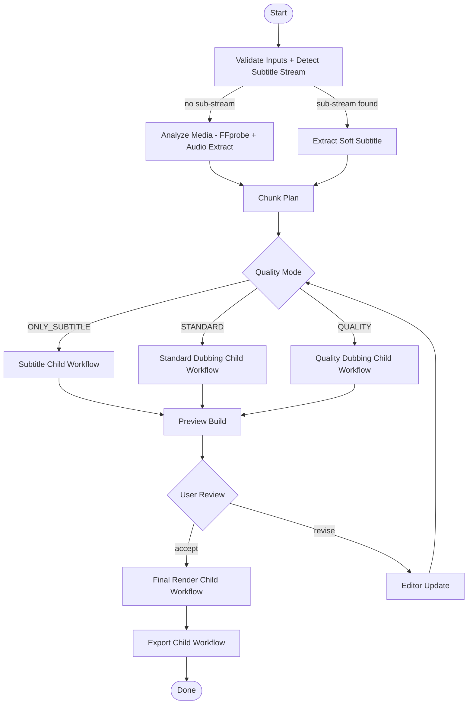
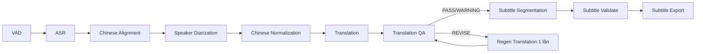
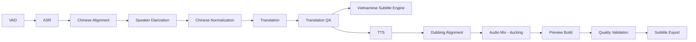

# Workflow — Production DAG for Chinese → Vietnamese Video Localization

Tài liệu này mô tả DAG production dùng Temporal. Domain định nghĩa graph; Temporal là execution engine. Workflow không giữ business state (đó là PostgreSQL); Temporal chỉ là durable execution layer.

## 1. Định nghĩa chung

- Mỗi project có một `Project Workflow` chính (`project_id`).
- `Project Workflow` sinh child workflows theo `quality_mode`:
  - `ONLY_SUBTITLE`: chỉ phụ đề.
  - `STANDARD_DUBBING`: lồng tiếng cơ bản.
  - `QUALITY_DUBBING`: lồng tiếng đầy đủ QA + second-pass ASR.
- Với video dài > 60 phút, mỗi stage có thể sinh `Chunk Child Workflow` để chia theo đoạn audio hoặc theo scene.
- Activity idempotency dựa vào `ArtifactSignature`; retry sẽ tận dụng cache thay vì chạy lại model.

## 2. Project Workflow (cha)

## 3. Subtitle Child Workflow

## 4. Standard Dubbing Child Workflow

## 5. Quality Dubbing Child Workflow

Thêm các bước: Audio Separation, chiến lược dubbing nâng cao, Second-pass ASR, validation mạnh hơn.

```mermaid
flowchart LR
    a[VAD] --> b[ASR]
    b --> c[Chinese Alignment]
    c --> d[Speaker Diarization]
    d --> e[Chinese Normalization]
    e --> f[Translation]
    f --> g[Translation QA]
    g --> h[Vietnamese Subtitle Engine]
    g --> k[TTS]
    sep[Audio Separation] --> mix[Audio Mix - ducking + stems]
    k --> align[Dubbing Alignment]
    align --> mix
    mix --> qa2[Second-pass ASR on Vietnamese audio]
    qa2 --> val[Quality Validation]
    val --> render[Final Render]
    render --> out[Export - SRT/VTT/ASS/MP4]
```

## 6. Chunk Child Workflow

- Input: time range `[start, end]` của chunk.
- Chạy song song với các chunk khác trong cùng workflow cha; activity-level concurrency được kiểm soát bởi task queue và GPU memory.
- Mỗi chunk sinh artifact riêng; cuối chunk workflow merge vào `chunk_merger` activity ở workflow cha.
- Chunk plan do `Analyze Media` sinh: chia theo scene detection (PySceneDetect) hoặc theo độ dài cố định (mặc định 5 phút).

## 7. Retry & resume policy

| Activity | Max attempts | Backoff | Non-retryable errors | Heartbeat |
|---|---|---|---|---|
| VAD | 3 | exponential 1s→8s | CapabilityUnsupported, ConsentMissing | n/a |
| ASR | 3 | exponential 2s→30s | CapabilityUnsupported | 30s |
| Alignment | 3 | exponential 2s→20s | CapabilityUnsupported | 30s |
| Diarization | 3 | exponential 2s→30s | CapabilityUnsupported | 30s |
| Translation | 2 | exponential 2s→20s | Quota, ConsentMissing | n/a |
| Translation QA | 1 | n/a | n/a (1 lần regen do workflow) | n/a |
| TTS | 3 | exponential 2s→30s | ConsentMissing, CapabilityUnsupported | 30s |
| Audio Separation | 2 | exponential 5s→60s | n/a | 60s |
| FFmpeg operations | 2 | exponential 1s→10s | n/a | 60s |
| FFprobe | 3 | exponential 1s→8s | n/a | n/a |

## 8. Cancellation & cleanup

- User cancel từ web → API gọi Temporal `CancelWorkflowExecution`.
- Workflow con đang chạy nhận cancel; activity đang chạy nhận `CancelledError` ở checkpoint an toàn (cuối segment) → partial artifact được dọn bởi cleanup activity.
- Cleanup activity chạy `delete_orphans(object_keys)`.

## 9. Artifact signature & caching

- Mỗi activity output phải kèm `ArtifactSignature`. Workflow dùng signature để quyết định có skip hay re-run khi user edit:
  - User chỉ đổi subtitle style → signature ASR/translate giữ nguyên → chỉ chạy subtitle export.
  - User đổi glossary → signature translation đổi → chạy lại từ translation; ASR cache vẫn dùng.
  - User đổi voice → signature TTS đổi → chạy lại TTS; translation cache vẫn dùng.
- Artifact signature phải được verify trước khi publish artifact cho downstream activity; mismatch → re-run.

## 10. Progress reporting

- Mỗi activity ghi `progress_pct` (0–100) và `progress_message` vào `workflow_steps`.
- Activity dài (TTS, ASR) ghi `progress_pct` theo segment đã xử lý.
- API đọc `workflow_steps` và phát SSE; không bao giờ phát phần trăm giả.

## 11. Quality mode switch

- Nếu user đổi `quality_mode` từ `STANDARD` → `QUALITY`, workflow chạy lại từ `Audio Separation` trở đi.
- Nếu user đổi `QUALITY` → `STANDARD`, các artifact quality-only vẫn giữ để user có thể upgrade lại.

## 12. Long video handling

- Video > 60 phút: workflow dùng `continue-as-new` sau mỗi chunk để tránh Temporal event history limit.
- Worker không load toàn file vào RAM; tất cả media IO qua `StorageProvider` stream.
- Mid-flight artifact lưu ở prefix `projects/{id}/tmp/`, TTL 7 ngày.

## 13. Failure modes & fallback

- Provider fail Transient → retry theo policy.
- Provider fail Permanent → raise `NonRetryableError`; workflow chuyển sang `FallbackPolicy` (preferred_alt hoặc human review).
- Worker crash → Temporal replay, activity idempotent dựa vào artifact signature.
- Storage outage → activity retry với backoff; nếu quá timeout → fail project, gửi SSE báo lỗi.

## 14. Activities inventory

Tổng hợp các activity sẽ cài trong Phase 1+:

- `ingest.detect_subtitle_stream`
- `media.analyze` (ffprobe, scene detection)
- `media.extract_audio`
- `media.chunk_plan`
- `asr.transcribe`
- `vad.detect`
- `alignment.align`
- `diarization.segment`
- `normalize.chinese`
- `translation.translate_segment`
- `translation.qa`
- `subtitle.segment`
- `subtitle.validate`
- `subtitle.export`
- `tts.synthesize`
- `audio.separate`
- `audio.mix`
- `dubbing.align`
- `validation.second_pass_asr`
- `render.build_preview`
- `render.build_final`
- `export.assemble`
- `cleanup.orphans`

## 15. Out-of-scope Phase 0

- Không cài đặt Temporal server, không tạo Dockerfile, không tạo activity code.
- Không định nghĩa số concurrency cho worker (sẽ quyết định ở deployment tier).
